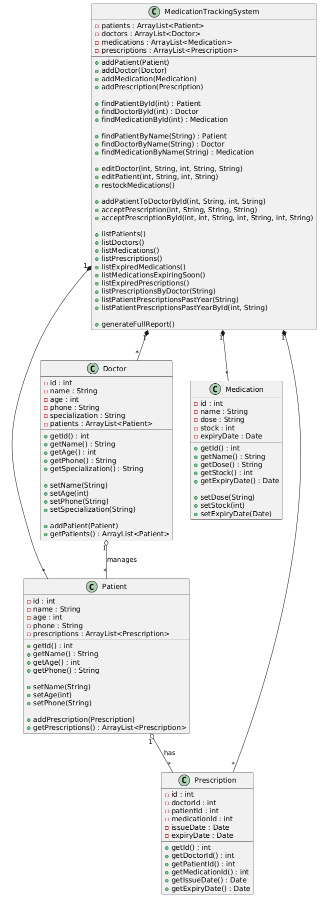

### Mid Term Sprint – Pharmacy Medication Tracking System ###
## Students: Feras Zen & Darrell Declaro
## Course: Java – Semester 3 (Summer 2026)

📌 Overview
The Pharmacy Medication Tracking System is a Java-based console application designed to manage patients, doctors, medications, and prescriptions within a pharmacy environment.
The system implements full OOP principles, supports all required features from the Mid-Term Sprint assignment, and includes:
- CRUD operations
- Prescription management
- Doctor–patient linking
- Medication stock tracking
- Expiry validation
- Full reporting system
- Menu-driven interface using Scanner

🚀 Implemented Features

✔ 1. Add Patient
Create and store patient records (ID, name, age, phone).

✔ 2. Add Doctor
Register doctors with ID, name, age, phone, specialization.

✔ 3. Add Medication
Add medications with ID, name, stock, expiry date.

✔ 4. Add Patient to Doctor
Assign a patient to a doctor’s managed list.

✔ 5. Accept Prescription
Create a prescription linking:
. Doctor
. Patient
. Medication
. Issue date
. Auto-calculated expiry date (+1 year)

✔ 6. Edit Doctor / Patient / Medication
Modify entity information.

✔ 7. Delete Doctor / Patient / Medication
Remove entities by ID.

✔ 8. Restock Medications
Automatically increase stock by a random amount (10–60 units).

✔ 9. Reporting System
Includes:
- List all patients
- List all doctors
- List all medications
- List all prescriptions
- Prescriptions by Doctor
- Patient prescriptions (past year)
- Expired medications
- Medications expiring soon
- Expired prescriptions
- Full system report

### System Architecture ###

# Class Overview
Class	                     Description
Person	                     Base class for Patient & Doctor
Patient	                     Stores patient info + prescriptions
Doctor	                     Stores doctor info + assigned patients
Medication	                 Stores medication details
Prescription	             Links doctor, patient, medication
MedicationTrackingSystem	 Core logic & operations
Main	                     Console menu interface

# UML Class Diagram
The UML diagram is located in the /docs folder.

▶️ How to Run the Application

1. Navigate to the src folder
bash
cd src
2. Compile all Java files
bash
javac *.java
3. Run the program
bash
java Main

📂 Project Structure
Code
PharmacyManagementSystem/
│
├── src/
│   ├── Main.java
│   ├── MedicationTrackingSystem.java
│   ├── Person.java
│   ├── Patient.java
│   ├── Doctor.java
│   ├── Medication.java
│   └── Prescription.java
│
├── docs/
│   ├── UserDocumentation.md
│   ├── DevelopmentDocumentation.md
│   └── UML-Class-Diagram.png
│
└── README.md

🧪 Prescription Lifecycle
Each prescription includes:
Issue Date: Current system date
Expiry Date: Issue date + 1 year

🔧 Restocking Logic
Medications are restocked using:
int randomAmount = (int)(Math.random() * 50) + 10;
This adds 10–60 units to each medication.

🎥 Video Presentation

A 5–10 minute video demonstrating:
System overview
Class structure
Running the application
Feature demonstration

(Uploaded according to course submission guidelines.)

🧑‍💻 GitHub Requirements
This project includes:
- Organized repository
- Multiple branches
- Pull Requests
- Documentation folder
- UML diagram
- README.md
